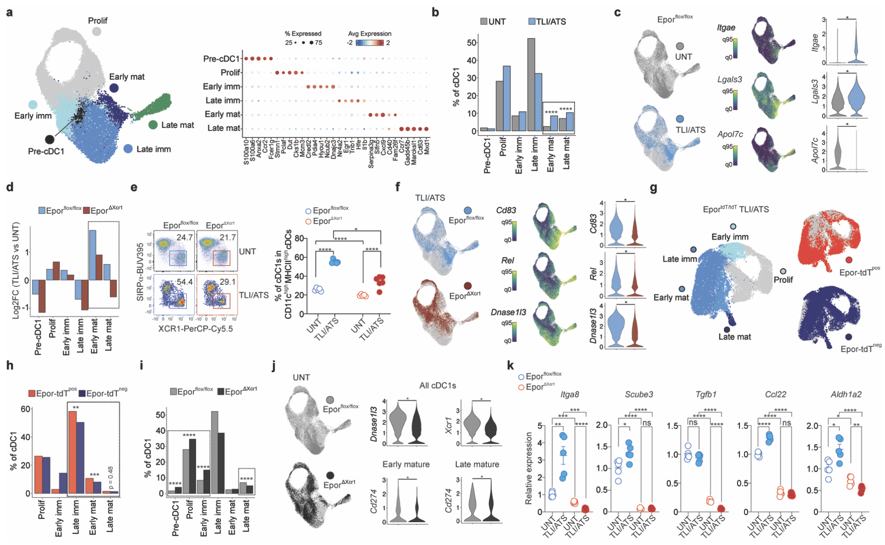
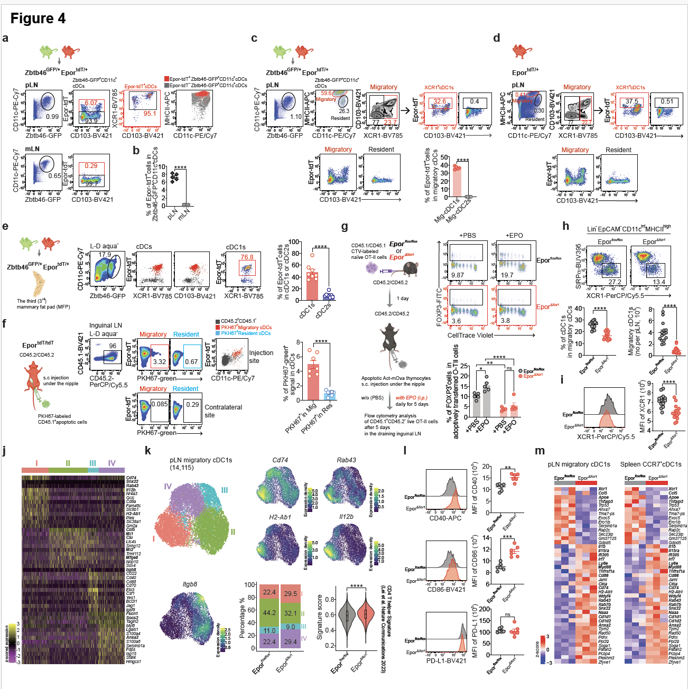
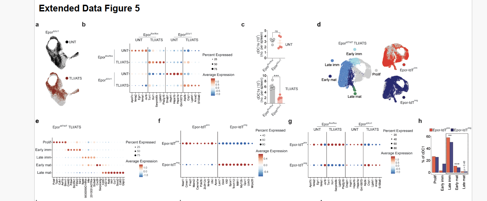

# epor_dc_tolerance
Companion code for Zhang*, McGinnis, et al, 2025. "Erythropoietin receptor on cDC1s dictates immune tolerance." Nature: https://www.nature.com/articles/s41586-025-09824-z

All objects needed to remake figures in manuscript available on synapse (synapse.org/Synapse:syn64330568)

