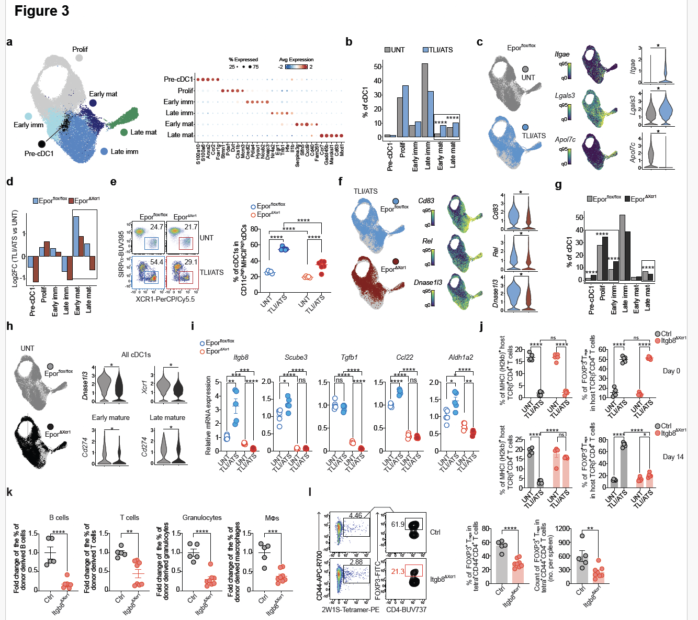

# epor_dc_tolerance
Companion code for Zhang*, McGinnis, et al, 2025. "Erythropoietin receptor on cDC1s dictates immune tolerance"

All objects needed to remake figures in manuscript available on synapse (synapse.org/Synapse:syn64330568)

Figure 3: Splenic cDC1 subtype UMAPs, sample UMAPs (EpoR-flox, EpoR-xcr1, TLI-ATS, untreated, EpoR-tdTomato+, EpoR-tdTomato-), marker gene violin and feature plots growth curves, and subtype frequency and log2FC barcharts

